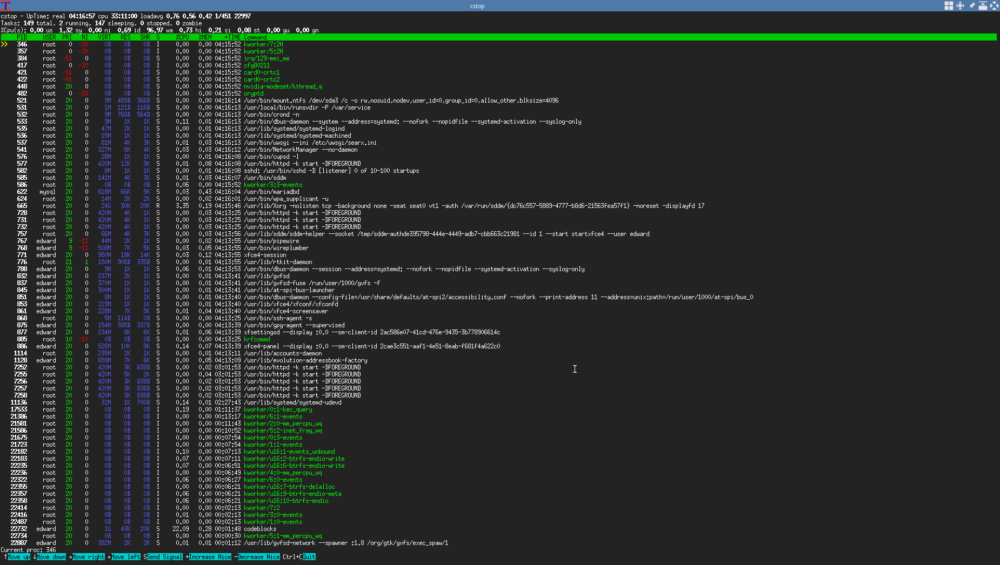

# cstop
cstop is a terminal-based process viewer/task manager.

# Screenshots

# Installation
## Windows (Cygwin64 only)
Install Cygwin. You can either use the terminal, or you can use an IDE. The command to compile with a terminal is `gcc cstop.c`. If you're using an IDE/external text editor, make sure you use *Cygwin GCC* as your compiler (eg: in Code::Blocks you go to Project->Build Options and you select your compiler from there).

## *NIX
`$ gcc main.c`

`$ ./a.out`
